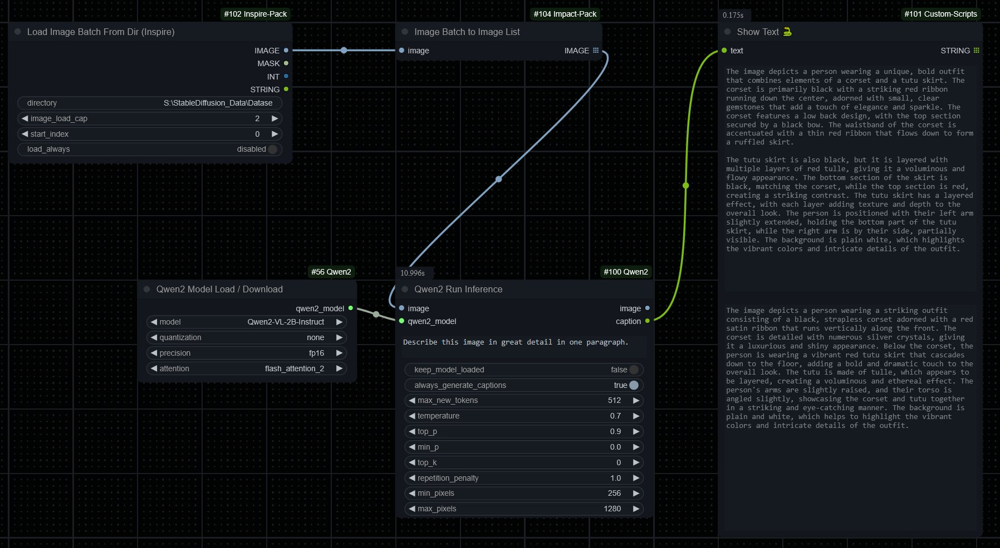

# ComfyUI-Qwen2
Qwen2 Nodes for ComfyUI.

I needed to run Qwen2 on ComfyUI to use it in my workflow for batching images and captioning and none of the implementations I found on the web worked the way I wanted.

> [!CAUTION]
> May contain bugs.

# Nodes list
Qwen2ModelLoader

Qwen2ModelRunInference

### Preview

  
Single image

  
Batch images

## Installation

Clone this repository to `ComfyUI/custom_nodes` directory.

## Docs and Credit
[Qwen2](https://huggingface.co/Qwen/Qwen2-VL-2B-Instruct)

**And, for all ComfyUI custom node developers**